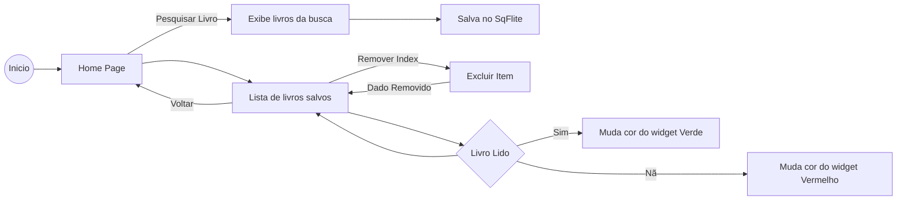

# Projeto de Livros - XLivros.

Projeto de repositório de leitura de livros - Fatec 2024.

## Requisitos:
<ol>
    <li>- [x] Consultar base de dados Google Book API​</li>
    <li>- [x] Utilizar SqFlite</li>
    <li>- [x] Salvar os livros escolhidos na base de dados local</li>
    <li>- [x] Criar páginas e utilizar Navigator</li>
</ol>

## Cruso:

[DSM] Desenvolvimento de software multiplataforma

## Alunos:

Otávio Thadeu Franklin da Cunha
Cleber Pereira dos Santos Junior

## Fluxograma:

### Minhas redes sociais, conecte-se comigo:

### Um pouco do meu GitHub:

